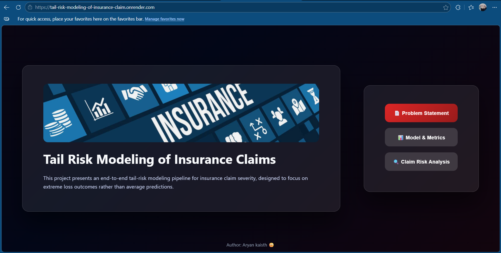
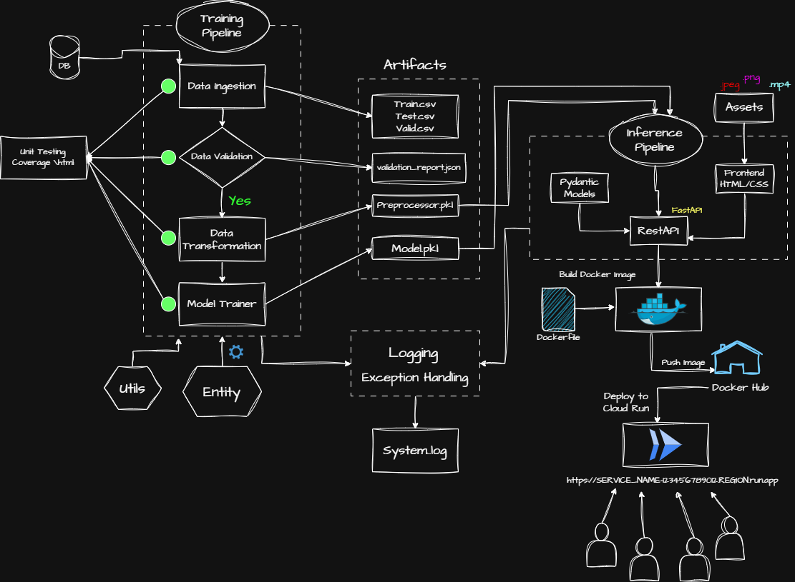

# Tail Risk Modeling

---

## 🎥 Click Image To Watch Demo Video

---

<h2 style="color:#ffffff; margin:0;">Table of Contents</h2>

- [Motivation](#motivation)
- [Problem Statement](#problem-statement)
- [Dataset](#dataset)
- [Evaluation & Metrics](#evaluation--metrics)
- [Key Results](#key-results)
- [End-to-End MLOps Architecture](#end-to-end-mlops-architecture)

---

<h2 style="color:#ffffff; margin:0;">Motivation</h2>

In most insurance portfolios, the majority of claims are relatively small, while a small number of catastrophic events account for a disproportionate share of total losses. These rare but high-severity claims are the primary drivers of reserve requirements, capital allocation, and long-term insurer solvency.

Traditional regression approaches focus on predicting the average claim outcome, which can lead to systematic underestimation of extreme losses. In practice, however, understanding the behavior of the upper tail of the loss distribution is far more important for risk management.

In this project, I address this gap by explicitly modeling the upper quantiles of claim severity, enabling more reliable estimation of potential extreme losses.

---

<h2 style="color:#ffffff; margin:0;">Problem Statement</h2>

Modeling insurance claim severity is challenging due to the highly skewed and heavy-tailed nature of loss distributions. Most claims cluster around relatively small values, while extreme losses appear infrequently but can be several orders of magnitude larger. This imbalance makes conventional regression approaches difficult to apply effectively, as models optimized for average prediction error tend to be dominated by the bulk of small claims.

The goal of this project is to develop a modeling framework that can reliably estimate upper-tail risk in claim severity. Instead of predicting the conditional mean loss, the model is designed to estimate conditional quantiles of the loss distribution, such as the **90th percentile (P90)**, for a given set of claim features.

By focusing on quantile estimation, the system aims to produce stable and interpretable risk thresholds for unseen claims. These thresholds provide a practical way to characterize potential extreme outcomes within the data and evaluate how claim characteristics influence the upper tail of the loss distribution.

---

<h2 style="color:#ffffff; margin:0;">Dataset</h2>

This project uses the **Allstate Claims Severity** dataset.

### Summary

- ~188,000 historical insurance claims
- 14 normalized continuous variables (`cont1`–`cont14`)
- 116 high-cardinality categorical variables (`cat1`–`cat116`)
- Target: Insurance claim severity (loss amount)
- Strongly right-skewed and heavy-tailed target distribution
- Features are anonymized, simulating real-world enterprise constraints

### Why Quantile Regression?

- Directly estimates upper-tail risk (e.g., the 90th percentile) instead of the conditional mean.
- More suitable for insurance reserving and catastrophic loss estimation.
- Produces conservative and interpretable risk thresholds.
- Supports pricing, capital allocation, reserving, and stress testing.

---

<h2 style="color:#ffffff; margin:0;">Evaluation & Metrics</h2>

The model is evaluated using metrics specifically designed for quantile regression.

| Metric | Purpose |
|---------|---------|
| **Pinball Loss** | Measures quantile prediction error with asymmetric penalties for over/under prediction. |
| **D² (Quantile R²)** | Measures improvement over an unconditional quantile baseline. |
| **Coverage** | Measures calibration. For τ = 0.90, approximately 90% of observations should lie below the predicted quantile. |

These metrics provide a more meaningful evaluation of tail-risk models than traditional regression metrics such as RMSE or MAE.

---

<h2 style="color:#ffffff; margin:0;">Key Results</h2>

- **Target Quantile:** τ = 0.90
- **Mean Pinball Loss:** **341.46**
- **D² (Quantile R²):** **0.4859**
- **Empirical Coverage:** **0.8940**

### Summary

- ✅ Approximately **48.6% improvement** over a naive unconditional quantile baseline.
- ✅ Coverage is **very close** to the target 90%, indicating a well-calibrated model.
- ✅ Effectively captures upper-tail insurance claim severity for risk-focused applications.

---

<h2 style="color:#ffffff; margin:0;">End-to-End MLOps Architecture</h2>

This project follows a complete **end-to-end MLOps workflow**, covering the entire machine learning lifecycle from data ingestion to cloud deployment.

The architecture includes:

- Data ingestion, validation, and transformation
- Quantile regression model training
- Generation of reusable model artifacts
- Prediction (inference) pipeline
- REST API using FastAPI and Pydantic
- Docker containerization
- Deployment to Google Cloud Run
- Centralized logging and exception handling
- Automated unit testing

  

The deployed application exposes a REST API through **Google Cloud Run**, enabling scalable and containerized prediction of upper-tail insurance claim severity.

---
